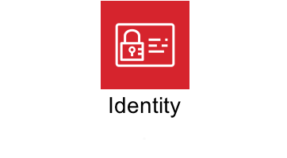

# AWS Security Workshops

<!--  -->

      

Here you'll find a collection of security workshops and other hands-on content that will guide you through prepared scenarios that represent common use cases and security operational tasks on Amazon Web Services (AWS). The workshops align loosely to the [Security Perspective of the AWS Cloud Adoption Framework](https://aws.amazon.com/blogs/security/new-whitepaper-now-available-the-security-perspective-of-the-aws-cloud-adoption-framework/) and provide a deep dive into a variety of AWS security services, techniques, and best practices that'll you'll be able to apply to your own environments to better improve your security posture.

## To start a workshop:

Visit the workshop portal to get started: [https://awssecworkshops.com](https://awssecworkshops.com)

> All workshops previously listed here have been migrated to the portal and are listed in the [directory](https://awssecworkshops.com/workshops/).

## To deliver a workshop:

Coming soon!

## To submit an idea:

If you have ideas for topics or scenarios you would like to see included in new workshops please let us know by submitting it as an issue or contacting us directly at <a href="mailto:aws-security-workshops@amazon.com?subject=AWS Security Workshops: Idea Submission">aws-security-workshops@amazon.com</a>

## License Summary

This sample code is made available under a modified MIT license. See the [LICENSE](LICENSE) file.
