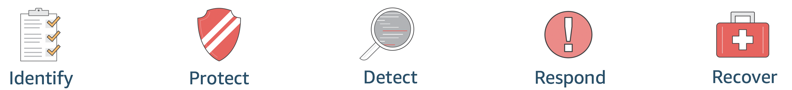
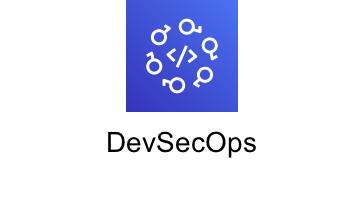

# AWS Security Workshops

<!--  -->

<table>
 <thead>
        <tr>
            <th colspan="3" align=
            "center">Workshop Themes</th>
        </tr>
    </thead>
    <tbody>
  <tr>
    <td> </td>
    <td> </td>
    <td></td>
  </tr>
  <tr>
    <td>  </td>
    <td> </td>
    <td></td>
  </tr>
  </tbody>
</table>

!!! info "7/14/2020 - Latest workshop"
   
    <a class="table" target="_blank" href="https://security-hub-workshop.awssecworkshops.com/">**Integration, Prioritization, and Response with AWS Security Hub Overview**</a>

    This workshop is designed to get you familiar with AWS Security Hub so that you can better understand how you would use it in your own AWS environment(s). This workshop is broken into two sections. The first section will guide you through a demonstration of the features and functions of Security Hub. The second section will show you how to use Security Hub to import findings from different data sources, analyze findings so you can prioritize response work, and implement responses to findings to help improve your security posture.

Welcome to the AWS security workshops portal! Here you will find a collection of workshops and other hands-on content aimed at helping you gain an understanding of the AWS service ecosystem and introduce you to a variety of best practices that can be applied to securing your environments and workloads running in AWS.

Security and Compliance is a <a href="https://aws.amazon.com/compliance/shared-responsibility-model/" target="_blank">shared responsibility</a> between AWS and the customer. AWS is responsible for protecting the infrastructure which runs all of the services offered and this responsibility is known as the **Security of the Cloud**. AWS customers benefit from a data center and network architecture built to satisfy the requirements of the most security-sensitive organizations. Customers responsibility, known as the **Security in the Cloud**, is determined by which services the customer chooses to use.

The workshops and other hands-on content contained in this portal are focused on the **Security in the Cloud** and they will guide you through prepared scenarios that represent common use cases and operational tasks you'll face in building securely on AWS. They will also highlight the design principals from the <a href="https://d1.awsstatic.com/whitepapers/architecture/AWS-Security-Pillar.pdf" target="_blank">AWS Well-Architected Framework Security Pillar</a>, which can help you improve your security posture. Finally, in order to help you take a more holistic approach to security on AWS, we divide a lot of the content up into categories aligned to the <a href="https://www.nist.gov/cyberframework/online-learning/five-functions" target="_blank">NIST Cybersecurity Framework Core Functions</a> to help you understand the scope of the content.

**Key Cloud Security Design Principals**

* *Implement a strong identity foundation*
* *Enable traceability*
* *Apply security at all layers*
* *Automate security best practices*
* *Protect data in transit and at rest*
* *Keep people away from data*
* *Prepare for security events*

## Additional resources

Below are some additional resources that have some great hands-on content:

<ul>
    <li><a href="https://wellarchitectedlabs.com/Security/README.html" target="_blank">AWS Well-Architected Security Labs</a></li>
    <li><a href="http://www.awsmanagementweek.com/" target="_blank">AWS Management Services Workshops</a></li>
</ul>

